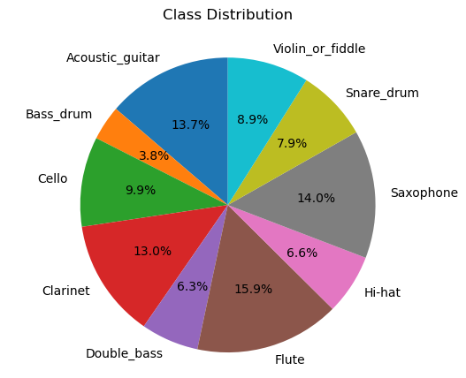
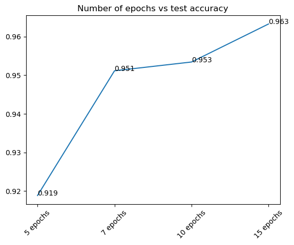
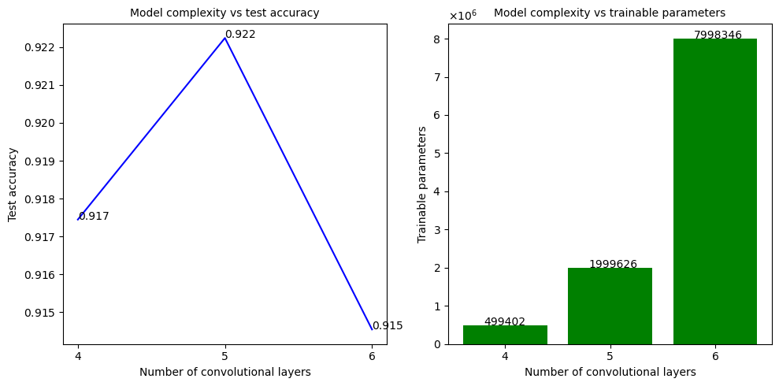

# 🎸🥁🎺 Instrument Classification using deep learning

## Project Objective

The objective of this project is to classify musical instruments from audio data using deep learning techniques such as convolutional neural networks(CNN) and recurrent neural networks (RNN).

Additionally, this project would also try to explain the existing solution for the problem statement, try to optimize the existing solution and provide a comparison between the optimized and existing solutions.

## Introduction

The existing solution is taken from https://github.com/seth814/Audio-Classification. It provides the steps for data pre-processing, exploratory data analysis and modelling using deep learning methods such as convolutional neural networks (CNNs) and recurrent neural networks (RNNs).

The key idea is that the neural networks try to learn patterns and correlations which exist in the audio data to predict the musical instruments from an unseen audio file.

## Tools/libraries used

1. Python
2. Matplotlib, scikit-learn and pandas
3. Keras
4. Keras-tuner
5. Jupyter notebook
6. python_speech_features, librosa, scipy

### Data source & description

Originally, the dataset belongs to https://www.kaggle.com/competitions/freesound-audio-tagging/data which is a more generalized audio dataset consisting of audio files for sounds like finger snapping, fireworks, laughter, knocks etc. but for this project, the idea is to utilize a subset of that data, particularly corresponding to musical instruments. The subset is available in the GitHub repo mentioned above and it consists of around <b>300 .wav</b> files, which contain the recordings of <b>10 different musical instruments</b>.

The musical instruments are as follows:

* Bass drum
* Acoustic guitar
* Hi-hat
* Clarinet
* Flute
* Saxophone
* Double bass
* Violin/Fiddle
* Cello
* Snare drum

## Exploratory Data Analysis

There are four kinds of plotting functions that are used for EDA:

<b>1. Time series (simple waveform)</b>

The audio waveform, which is a raw representation of the audio signal across time, is frequently represented in audio analytics using time series. To extract valuable features that may be applied to audio classification, voice recognition, and other audio-related tasks, this waveform can be studied using a variety of techniques.

<b>2. Fast Fourier Transforms</b>

A time-domain signal is converted into its frequency-domain representation using the mathematical process of FFT. This method is used to examine the audio waveform's frequency content. FFT is used in audio analytics to extract features including spectrum peaks, spectral moments, and spectral entropy as well as to identify the various frequencies present in an audio sample.

<b>3. Filter Bank Coefficients</b>

A group of features called Filter Bank Coefficients (FBC) are taken from an audio signal using a bank of filters. These filters are made to simulate the human ear's frequency response, which responds differently to different frequencies. After that, each filter's output is processed to obtain important characteristics including each band's energy, centroid frequency, and spectral flatness. Speech recognition and music genre identification frequently employ FBC.

<b>4. Mel Frequency Cepstral Coefficients</b>

In audio analytics, the feature extraction method known as MFCC is frequently employed. Its foundation is the notion that the nonlinear processing of sound by the human auditory system and the unequal spacing of the most important frequency bands for audio perception. Applying a bank of filters to the audio signal before calculating the logarithm of the energy in each filter output is how the MFCC is calculated. The obtained features are then subjected to a Discrete Cosine Transform (DCT) to provide a collection of coefficients that are frequently applied to speech recognition and audio classification applications. Speaker identification, voice recognition, and emotion recognition are all common uses for MFCC.

## Data pre-processing

The key pre-processing task that we're performing here is a filtering process applied to the audio files, which includes removing those parts of the audio which do not cross a particular threshold value of amplitude.

## Building the classification model

1. Base CNN and RNN models were used with 5 training epochs each, and the following results were obtained:

2. The next step was to tune the base CNN model and try to achieve better accuracy:

    - Method 1: Manually comparing results with different number of epochs and number of convolutional layers

        
        
    
    - Method 2: Using the KerasTuner library

## Results and key conclusions

The results and key conclusions are as follows:

1. The baseline convolutional neural network outperformed the baseline recurrent neural network

2. Based on the optimization techniques:

    i) Increasing the number of training epochs resulted in an improvement in test accuracy. It means that the weights and biases were optimized more often as we increased the epochs. Although, this comes with a caveat that there is only a certain peak performance that we can achieve through just by increasing the number of epochs.
    
    ii) Increasing the model complexity also increased the test accuracy in the models. This comes with the tradeoff with training time and the number of trainable parameters in the model.
    
    iii) The same optimization process can be done through an inbuilt library which is keras-tuner. It is specifically built for keras based deep learning models. It is more flexible in the sense that it provides various options for hyper-parameter tuning including number of hidden layers, dropout thresholds, algorithm optimizer to be used and so on
   
3. The best model observed was the 15-epoch CNN model with 4 convolutional layers and 2 hidden layers. It's test accuracy was 96.3% compared to the baseline CNN model which showed a test accuracy of 90.7%

4. All the models, result files, diagrams and predictions were saved in their respective folders for future reference. The predictions helped us understand the probabilities of choosing the corresponding output class label for the instruments.

5. Overall, CNNs turned out to be much better than RNNs for this specific project. It is due to the fact that CNNs generally perform very well for image based inputs. In our case, the inputs to the CNNs were the MFCCs.
